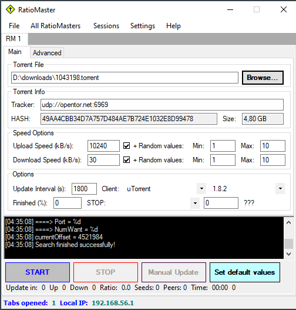

# RatioMaster

[](https://github.com/FastyRepos/FastRatioMaster)

## About

RatioMaster is a small standalone Windows application which fakes upload and download stats of a torrent to almost all BitTorrent trackers.

This means that it does NOT rely on your BitTorrent client (uTorrent, Azureus, BitComet, ABC, etc.) and it will NOT download/upload the files on a torrent — it only fakes download/upload stats.

RatioMaster has hardcoded emulations for commonly used BitTorrent clients: uTorrent, BitComet, Azureus, ABC, BitLord, BTuga, BitTornado, Burst, BitTyrant, BitSpirit.

## What will it look like?

[](preview.png)

## Download

Published builds (when available) are on this repository’s [releases](https://github.com/FastyRepos/FastRatioMaster/releases) page.

## Development

See `AGENTS.md` for Cloud/agent notes. On Windows with Visual Studio / MSBuild:

```bat
make.bat
```

Or:

```bat
msbuild RatioMaster.sln /t:restore /p:RestorePackagesConfig=true
msbuild RatioMaster.sln /t:Rebuild /p:Configuration=Release
```

Output: `RatioMaster\bin\RatioMaster.exe`

## How can I help improve it?

Feedback and contributions are welcome. Open an issue or pull request on
[FastyRepos/FastRatioMaster](https://github.com/FastyRepos/FastRatioMaster).

## Warranty

This program is distributed in the hope that it will be useful, but WITHOUT ANY WARRANTY; without even the implied warranty of MERCHANTABILITY or FITNESS FOR A PARTICULAR PURPOSE.
